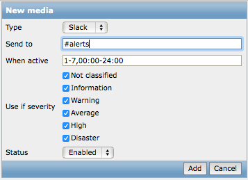

Zabbix Slack PrettyAlertScript
==============================

Fork
-----
This is my fork of [Eric OC's](https://github.com/ericoc) extremely useful [Zabbix Slack Alert Script](https://github.com/ericoc/zabbix-slack-alertscript).

It adds functionality to improve formatting, and some template suggestions.

About
------

This Bash script uses the custom alert script functionality within [Zabbix](http://www.zabbix.com/) along with the incoming web-hook feature of [Slack](https://slack.com/) to generate "pretty" alerts in Zabbix, color-coded to the alert type. When using the template suggested, it also provides links to the relevant graphs with each generated alert.

#### Versions
This works with Zabbix 2.0 or greater (including 2.2 and 2.4) as well as Zabbix 1.8.2!

#### Huge thanks and appreciation to:

* [Eric OC](https://github.com/ericoc), the original author of this script!
* [Paul Reeves](https://github.com/pdareeves/) for the hint that Slack changed their API/URLs!
* [Igor Shishkin](https://github.com/teran) for the ability to message users as well as channels!
* Leslie at AspirationHosting for confirming that this script works on Zabbix 1.8.2

Example Screenshot
-------------------

Installation
------------

### The script itself

The ["slack.sh" script](https://github.com/GeoffMaciolek/zabbix-slack-prettyalertscript/raw/master/slack.sh) needs to be placed in the "AlertScriptsPath" directory that is specified within the Zabbix servers' configuration file (zabbix_server.conf) and must be executable by the user (usually "zabbix") running the zabbix_server binary on the Zabbix server before restarting the Zabbix server software:

	[root@zabbix ~]# grep AlertScriptsPath /etc/zabbix/zabbix_server.conf
	### Option: AlertScriptsPath
	AlertScriptsPath=/usr/local/share/zabbix/alertscripts

	[root@zabbix ~]# ls -lh /usr/local/share/zabbix/alertscripts/slack.sh
	-rwxr-xr-x 1 root root 1.4K Dec 27 13:48 /usr/local/share/zabbix/alertscripts/slack.sh

Feel free to edit the user name at the top of the script while making sure that you specify your correct Slack.com incoming web-hook URL:

	# Slack incoming web-hook URL and user name
	url='https://hooks.slack.com/services/QW3R7Y/D34DC0D3/BCADFGabcDEF123'
	username='Zabbix'

### At Slack.com

An incoming web-hook integration must be created within your Slack.com account which can be done at [https://my.slack.com/services/new/incoming-webhook](https://my.slack.com/services/new/incoming-webhook) as shown below:

Given the above screenshot, the incoming web-hook URL would be:

	https://hooks.slack.com/services/QW3R7Y/D34DC0D3/BCADFGabcDEF123

### Within the Zabbix web interface

When logged in to the Zabbix servers web interface with super-administrator privileges, navigate to the "Administration" tab, access the "Media Types" sub-tab, and click the "Create media type" button.

You need to create a media type as follows:

* **Name**: Slack
* **Type**: Script
* **Script name**: slack.sh

...and ensure that it is enabled before clicking "Save", like so:

Then, create a "Slack" user on the "Users" sub-tab of the "Administration" tab within the Zabbix servers web interface and specify this users "Media" as the "Slack" media type that was just created with the Slack.com channel ("#alerts" in the example) or user name (such as "@ericoc") that you want messages to go to in the "Send to" field as seen below:

Finally, an action can then be created on the "Actions" sub-tab of the "Configuration" tab within the Zabbix servers web interface to notify the Zabbix "Slack" user.  My recommendation follows, as it will put the hostname in the message title, select the correct color, and provide a useful link to graph history.

* **Name:** Slack Alert
* **Subject:** PROBLEM {HOST.NAME}
* **Default Message:** {TRIGGER.NAME} {TRIGGER.STATUS} {TRIGGER.SEVERITY}\n\n&lt;https://PLACE\.YOUR.ZABBIX.URL.HERE/history.php?action=showgraph&amp;itemid={ITEM.ID1}|{ITEM.NAME1} Graph&gt;
* **Recovery message enabled:** Yes
* **Recovery Subject:** RECOVERY {HOST.NAME}
* **Recovery Message:** {TRIGGER.NAME}: {TRIGGER.STATUS}

Keeping the messages short is probably a good idea; instead of the above, you could also use something such as the following for the contents of each message:

	{TRIGGER.NAME} - {HOSTNAME} ({IPADDRESS})

Additionally, you can have multiple different Zabbix users each with "Slack" media types that notify unique Slack users or channels upon different triggered Zabbix actions.

## Testing

Assuming that you have set a valid Slack web-hook URL within your "slack.sh" file, you can execute the script manually (as opposed to via Zabbix) from Bash on a terminal:

	$ bash slack.sh '@ericoc' 'PROBLEM FakeServername' 'Oh no! Something is wrong!'

Alerting a specific user name results in the message actually coming from the "slackbot" user using a "spoofed" user name within the message. A channel alert is sent as you would normally expect from whatever user name you specify in "slack.sh":

More Information
----------------
* [Slack incoming web-hook functionality](https://my.slack.com/services/new/incoming-webhook)
* [Zabbix (2.2) custom alertscripts documentation](https://www.zabbix.com/documentation/2.2/manual/config/notifications/media/script)
* [Zabbix (2.4) custom alertscripts documentation](https://www.zabbix.com/documentation/2.4/manual/config/notifications/media/script)
